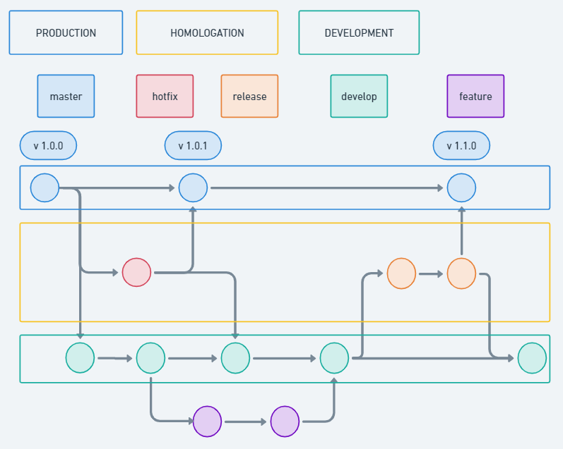
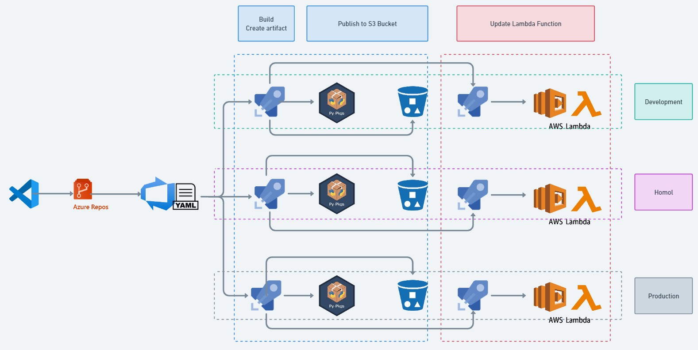

# CI/CD

## Introduction
The purpose of this document is to present, in a theoretical way, how the application's development and deployment flow would be carried out. 

---

## Gitflow
Gitflow would follow a standard line of what already exists on the market. With three environments for working with the code.

### Environmets
As previously mentioned, there will be three environments. Let's take a closer look.

- **Development:** In the development environment, this is where we will have our code running, so that the developers can validate their changes to the code. 

- **Homologation:** In the homologation environment, this is where the team is able to promote the code for release, and where the QA team is able to validate and test the code. It's also where any hotfixes that arise will be worked on.

- **Production:** The production environment is where the stable code should be. In this environment, any and all changes must be approved and tested by the QA team.

### Branchs

Gitflow has five branches, which must be followed and used in order for the entire process to work properly.

- **feature:** This is a branch created from develop. This is where the programmer will do all the code development. For the code here to run in a development environment, it needs to make a pull request to the develop branch.

- **develop:** This is the branch that has the code that runs in the development environment. This branch does not accept direct commits and accepts PRs from all branches except the master.

- **release:** When the initial tests and development are finished, the code is promoted to release. This branch is created from develop and can make pull requests to master. This branch has the code executed in the approval environment.

- **hotfix:** If there is a problem in production that needs to be fixed by the development team, this branch is created from the master. The code is validated in the approval environment and a PR is made to master and develop.

- **master:** This is the branch where the stable code should be. Any code here will be sent to the production environment. The only branches that can open PRs for this one are hotfix and release.

### Gitflow schema:

---

## Tools
For the CI/CD pipeline, we will utilize the following technologies and tools: **Git** and **Azure DevOps**. The code must include the *requirements.txt* file with all the dependencies for the application.

## How it works

The flow begins with the approval of the pull request and the branch merge. Depending on the branch, it will trigger the pipeline for different environments. All repositories and branches should have a YAML file named "*azure_pipelines.yaml*", where the rules and triggers for the start of our pipeline will be defined.

The next step in the workflow will be to generate the artifact. It will involve installing dependencies listed in the *"requirements.txt"* file, creating a ZIP file with the code and dependencies, and publishing it to the AWS S3 Bucket.

Following that, the release stage is triggered. It will take this artifact, connect to AWS, and update our Lambda Function, allowing it to fetch the new artifact that has been built from the S3.

### Here is an example of the workflow.
