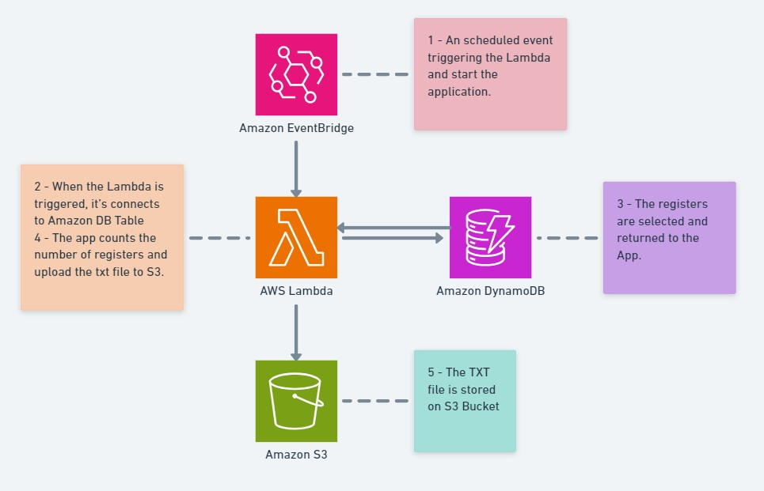

# lambda-data-exporter

## Description
This Python connect into DynamoDB Table, select and count the registers and put in a txt file, stored on a S3 Bucket.

It runs in Python 3.8 or higher.

The table name and S3 Bucket are setup in a Lambda Function as environment variable.

CI/CD idea: [CICD.md](./CICD.md)

---
## How to deploy
Read the main documentation [README.md](../README.md), section *To deploy/update the application*.